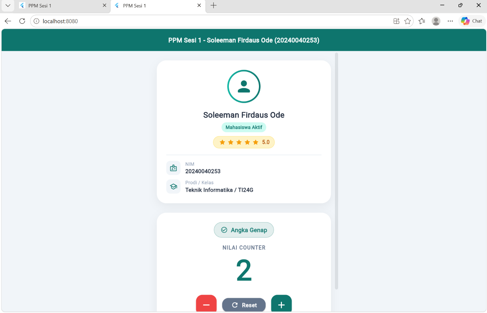

# PPM Sesi 1 - Flutter App

**Nama:** Soleeman Firdaus Ode  
**NIM:** 20240040253  
**Prodi / Kelas:** Teknik Informatika / TI24G

---

## Deskripsi

Aplikasi Flutter untuk tugas PPM Sesi 1. Fitur yang diimplementasikan:
- Profil Mahasiswa (nama, NIM, prodi/kelas, status, rating)
- Counter dengan validasi angka genap/ganjil
- Increment, Decrement, dan Reset counter

---

## Screenshot Hasil



---

## Cara Menjalankan

```bash
flutter pub get
flutter run
```
